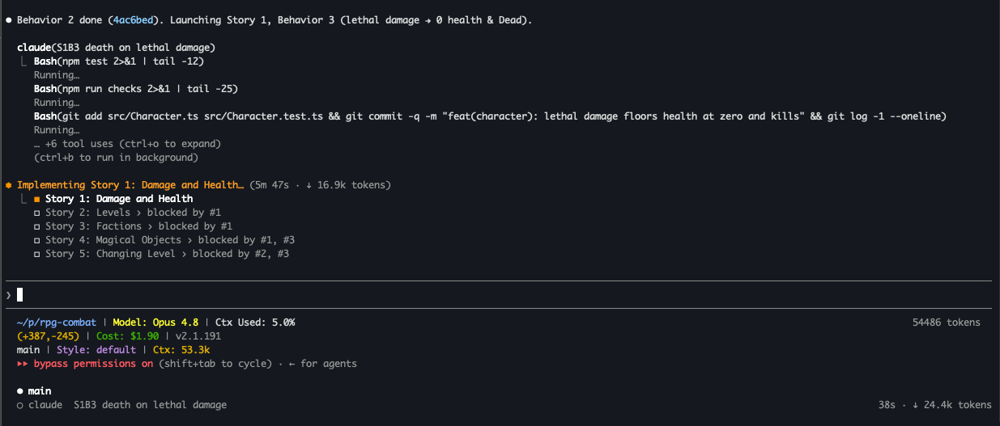
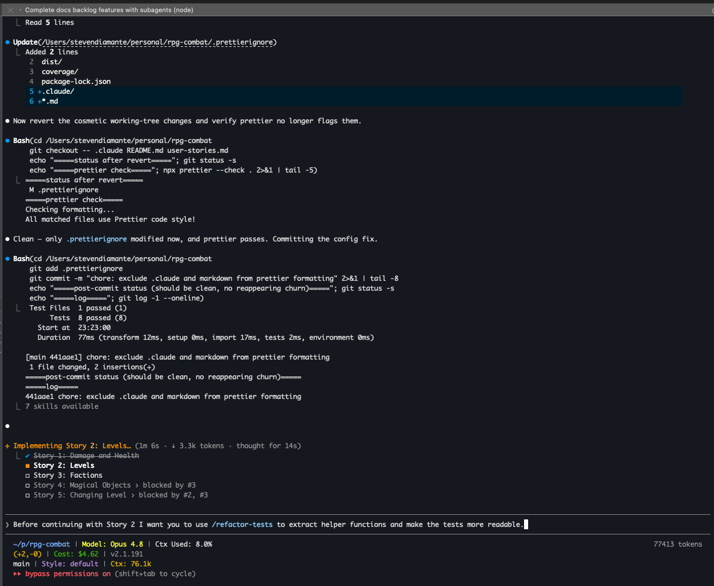
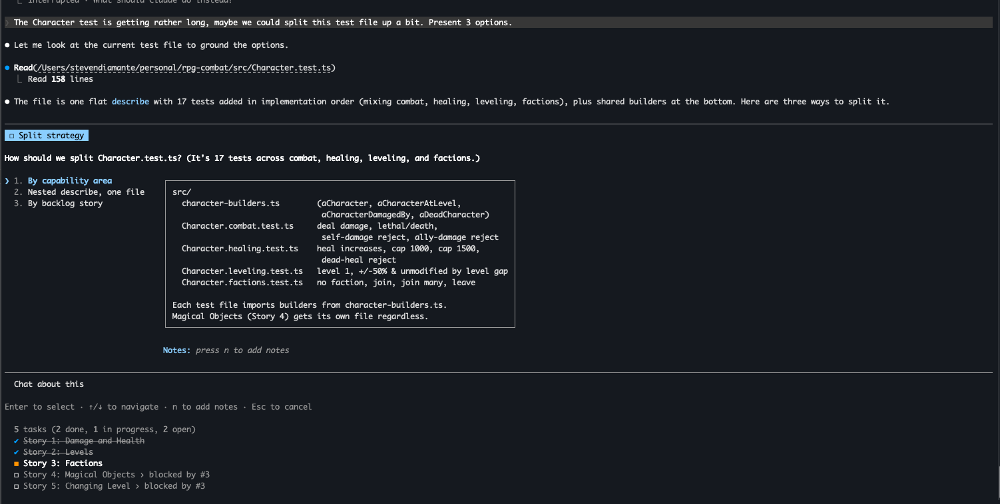
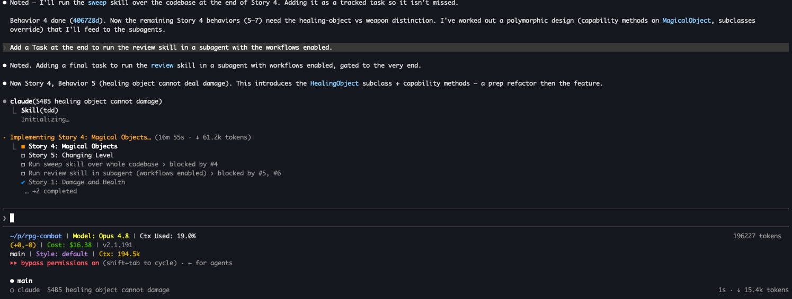

# Screenshots — the kata in motion

Real terminal captures from the run that produced this kata, in chronological order.
Model: **Claude Opus 4.8 · effort: high · 1M-token context window**. They show the
TDD-with-agents workflow — an orchestrator delegating one behavior at a time to fresh
subagents, a live task list, interactive decisions, and continuous refactoring.

> For the full prompt-by-prompt story, open the interactive [journey](../index.html).

## 1 · Orchestrator + subagent + task list

Early in Story 1. The orchestrator spawns a **fresh subagent per behavior**
(`S1B3 death on lethal damage`) which writes a test, runs `npm run checks`, and commits.
The task list tracks the five stories with their blocked-by dependencies. Status line:
Opus 4.8, context **53.3k (5%)**, ~$1.90 so far — the heavy lifting happens in disposable
subagent contexts, keeping the orchestrator lean.

## 2 · Refactoring tests after a story

Between stories the human calls `/refactor-tests` to extract helper builders and make the
tests read as a specification — quality folded in continuously, not bolted on at the end.

## 3 · An interactive decision (split strategy)

When `Character.test.ts` grew to 17 tests, the agent presented **three split options**
(by capability area / nested describe / by backlog story) with a concrete file layout, and
let the human choose — "By capability area" won. Decisions stay with the developer.

## 4 · Dynamic task list & growing context

By Story 4 the human adds tasks on the fly (run `/sweep`, then `/review` in a subagent with
workflows enabled, gated to the end). The polymorphic `MagicalObject` design is introduced
as a **prep-refactor then feature**. Context is now **194.5k (19%)**, ~$16.38 — still a
fraction of the 1M window after 20+ behaviors.
